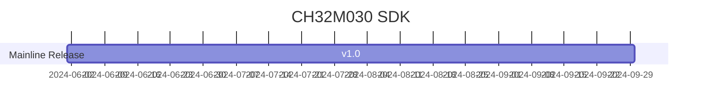
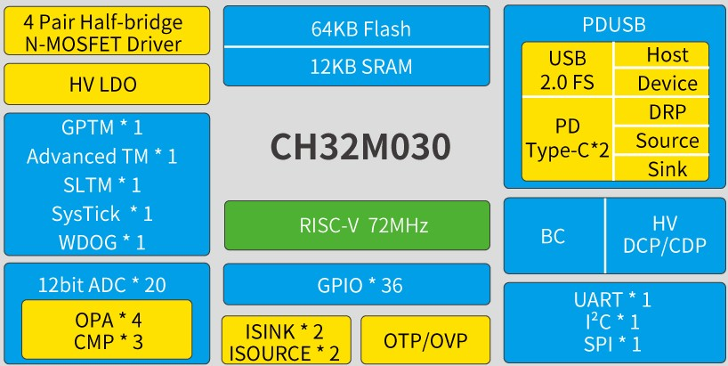

# [CH32M030](https://github.com/SoCXin/CH32M030)

* [WCH](http://www.wch.cn/)：[RISC-V](https://github.com/SoCXin/RISC-V)
* [L1R3](https://github.com/SoCXin/Level): 72 MHz 

## [简介](https://github.com/SoCXin/CH32M030/wiki)

[CH32M030](https://www.wch.cn/products/CH32M030.html) 系列是基于青稞RISC-V3B内核设计的工业级电机微控制器。CH32M030内置4个OPA运放和3个电压比较器CMP，支持组合成2组交流小信号放大解码器QII和2组差分输入电流采样ISP；内置USB PHY和PD PHY，支持USB Host主机和USB Device设备功能、PDUSB、Type-C快充功能、BC1.2及DCP/CDP等多种高压充电协议；内置4对N型功率管栅极预驱，提供高压I/O；内置可编程灌电流模块；提供DMA控制器、12位模数转换ADC、多组定时器、UART串口、I2C、SPI等外设资源，提供过压保护和过温保护。

### 关键特性

* 72MHz RISC-V3B (RV32IMCB)
* 12KB SRAM + 64KB Flash
* 内置高压LDO，VHV支持额定5～28V系统供电
* 预驱动I/O供电VDD8额定电压：5～10V
* 4个双N型MOSFET半桥驱动器，内置低压降自举二极管，外部只需要电容，可组合为三相电机栅极驱动或两路独立的全桥驱动
* 7路通用DMA控制器
* 12位模数转换ADC，20个外部通道，支持外部延迟触发，支持ADC滑动平均功能
* 4个运放OPA和3个模拟电压比较器CMP，可组合为2组交流小信号放大解码器QII1及QII2和2组差分输入电流采样ISP1及ISP2
* 2组Type-C和USB PD控制器及PHY
* 全速USB2.0控制器及PHY
* 支持BC1.2及多种HV DCP/CDP充电协议
* OTP过温保护和OVP过压保护及欠压复位
* 多引脚映射的UART串口，I2C接口，SPI接口
* 2组10位可编程灌电流模块
* 2组源电流模块
* 36个I/O口，映射16个外部中断
* 8个MV预驱动引脚，2个HV高压引脚
* 封装：LQFP48X7、LQFP48、QFN48、QFN32、QSOP28

## [资源收录](https://github.com/SoCXin)

* [参考资源](src/)
* [参考文档](docs/)
* [参考工程](project/)
* [mounriver开发环境](http://www.mounriver.com/download)

## [选型建议](https://github.com/SoCXin)

[CH32M030](https://github.com/SoCXin/CH32M030) 集成MOSFET半桥驱动器，集成LDO，VHV支持额定5～28V，支持USB-PD。

